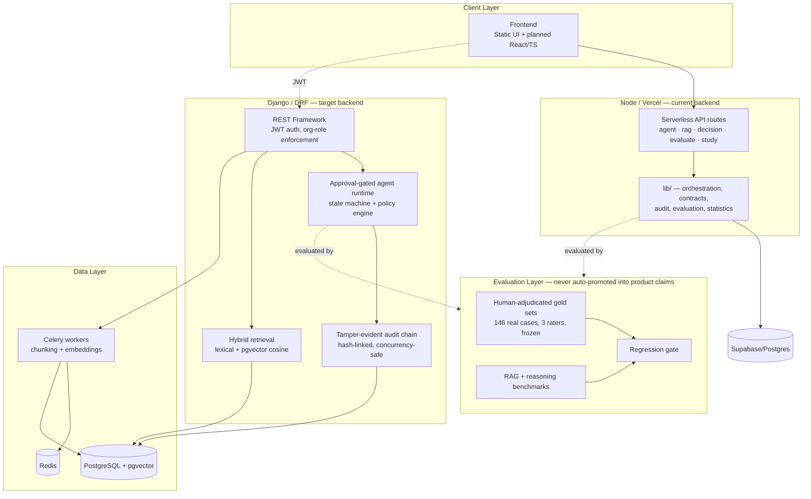

# ThinkForge

**An evidence-backed AI decision-support system** — it doesn't just generate a recommendation, it makes you prove the recommendation is trustworthy before it counts as evidence.

`v15.0.0` · Django/DRF backend (target) + Node/Vercel backend (current, in staged retirement) · PostgreSQL/pgvector · Celery/Redis

---

## The core idea, in one paragraph

Most "AI decision tools" are a chatbot with a nicer prompt. ThinkForge separates two things that usually get blurred together: **the product** (a workspace that turns a fuzzy decision into assumptions → evidence → a recommendation → an experiment → a recorded outcome) and **the proof** (a research-grade evaluation layer — human-adjudicated gold labels, a tamper-evident audit chain, regression gates — that answers "how do we know the AI's judgment can be trusted?"). Nothing in this repo reports a quality number that wasn't measured against real, frozen, human-labeled data.

---

## System architecture



**Why two backends exist at once:** Django is the committed long-term target (normalized data model, real tenant-role enforcement, an agent runtime with a genuine policy engine). Node/Vercel stays in place because five capabilities — deep research discovery, Jira integration, benchmark evaluation, the human-rater study workflow, and quality-gate scoring — have **zero Django equivalent yet** (confirmed by grep, documented in `DJANGO_MIGRATION.md`). Retiring Node before porting those would delete live product capability, not duplicate code. That's a recorded product decision, not an oversight.

---

## Component breakdown

| Component | What it does | Tech | Verified this session |
|---|---|---|---|
| **Agent runtime** (`backend/apps/core/agent.py`) | Plans a research task, enforces a role/approval/budget policy per tool, pauses for human approval before paid external calls, drives a strict state machine (`PLANNED → RUNNING → NEEDS_HUMAN_REVIEW → COMPLETED`) | Python / Django | ✅ 18/18 tests pass |
| **Audit chain** (`audit_integrity.py`) | Every agent action gets a SHA-256 digest chained to the previous event's hash — tampering (deletion, mutation, stripped hash) is detectable, not just logged | Python, hashlib | ✅ fixed & verified — `create_run()` wasn't feeding the chain; now does |
| **Tenant/role model** (`permissions.py`) | Viewer / editor / admin / reviewer roles scoped per organization; cross-org access is denied at the query level, not just the UI | Django ORM + DRF | ✅ covered by `test_permissions.py` |
| **Hybrid retrieval** (`retrieval.py`) | Lexical search always available; cosine-distance vector search via pgvector when embeddings are enabled; falls back honestly (and says so in the response) if not | Python, pgvector | ✅ covered by `test_retrieval.py` |
| **RAG evaluation harness** (`eval/`) | Benchmarks retrieval and reasoning quality against **frozen gold data**, not self-reported scores | Node scripts + JSON schemas | ✅ 236/241 Node tests pass, 5 correctly skipped (live-DB only) |
| **Human ground-truth pipeline** (`eval/external_gold/`) | 150 real cases → 3 independent raters (450 raw annotations) → disagreement adjudication → frozen gold set | CSV/JSON pipeline + documented protocol | 146 real, adjudicated, frozen cases (`stage1_gold.json`) |
| **Decision workspace** (product layer) | Assumption → evidence → challenge → recommendation → experiment → predicted-vs-actual outcome, for a real product decision | Node API + Supabase/Postgres | Infrastructure complete; real-usage data not yet collected (see Evidence status) |
| **CI/CD** (`.github/workflows/`) | Node checks + tests, Django tests, a staging DB-verification workflow that hard-fails without real staging secrets (won't silently pass) | GitHub Actions | — |

---

## The 15-stage product loop

```mermaid
flowchart LR
    A[1. Product<br/>discovery] --> B[2. Data<br/>model]
    B --> C[3. UX<br/>prototype]
    C --> D[4. Decision<br/>workspace]
    D --> E[5. Assumption<br/>engine]
    E --> F[6. Evidence<br/>system]
    F --> G[7. Challenge<br/>engine]
    G --> H[8. Decision<br/>flow]
    H --> I[9. Experiment<br/>designer]
    I --> J[10. Outcome<br/>tracking]
    J --> K[11. AI<br/>evaluation]
    K --> L[12. Analytics]
    L --> M[13. RAG]
    M --> N[14. PRD/Jira]
    N --> O[15. Advanced<br/>insights]
```



Full detail per stage in [`docs/ARCHITECTURE.md`](docs/ARCHITECTURE.md).

---

## Evidence status — the honest scoreboard

Run via `npm run research:readiness`. This table is the whole point of the project's claim policy: nothing below is reported unless it was actually measured.

| Signal | Status |
|---|---|
| Evaluation infrastructure (rater qualification, adjudication, frozen gold, regression gate) | Built and tested |
| Real annotated case bank | **146 real cases, adjudicated, frozen** — 450 rater rows, 3 independent raters, real source URLs |
| RAG gold-labeled queries | **124 real, frozen** |
| Backend test suite (Django) | **18/18 passing**, verified this session against sqlite |
| Full Node suite | **236/241 passing**, 5 correctly skipped (require a live DB, not faked) |
| Decision-impact study | Not yet started — template exists, awaiting a real study run |
| Outcome records (prediction vs. actual) | Not yet collected — requires real usage on a live deployment |

See [`docs/RESULTS.md`](docs/RESULTS.md) for the real-case results log (currently an empty, honest template) and [`docs/LOCAL_SETUP_GUIDE.md`](docs/LOCAL_SETUP_GUIDE.md) for how to actually fill it in.

---

## Quickstart

### Option A — Node/Vercel (current product layer)

```bash
npm install -g vercel
vercel dev
```

### Option B — Django backend (target architecture)

```bash
docker compose up -d postgres redis
cp backend/.env.example backend/.env   # fill in AI_API_KEY
docker compose up -d web worker
docker compose exec web python manage.py migrate
docker compose exec web python manage.py test apps.core.tests
```

Full walkthrough, including how to run real decisions and populate `RESULTS.md` with genuine data: [`docs/LOCAL_SETUP_GUIDE.md`](docs/LOCAL_SETUP_GUIDE.md).

### Free, no API key

Run the entire product with deterministic offline demo data — no cloud account, no cost: [`docs/FREE_DEMO_MODE.md`](docs/FREE_DEMO_MODE.md).

---

## Repository map

```text
thinkforge/
├── api/                  Node/Vercel serverless routes (current backend)
├── lib/                  Orchestration, contracts, audit, evaluation logic
├── backend/              Django/DRF target backend
│   └── apps/core/        Agent runtime, audit chain, permissions, retrieval
├── supabase/ + db/       SQL migrations (Node-side persistence layer)
├── frontend/             React/TS types + decision-governance UI pieces
├── eval/                 Benchmarks, schemas, and the human-adjudicated gold layer
│   └── external_gold/    146-case frozen gold set + full audit trail
├── scripts/               CI checks, eval runners, research/readiness reports
├── tests/                Node test suite (241 tests)
├── docs/                 Architecture, deployment, results, dataset card
└── docker-compose.yml    Postgres/pgvector + Redis + Django services
```

---

## Non-negotiable controls

1. No anonymous access to provider-backed AI or Jira in production.
2. No AI output enters product state without schema + business-rule validation.
3. No generated citation may reference an unknown evidence record.
4. No evaluation score is reported unless the actual system under test was executed.
5. Outcome analytics must distinguish deterministic prediction gaps from probabilistic calibration.
6. Every agent run produces at least one tamper-evident audit event — verified, not assumed.

---

## Portfolio positioning

> Built an evidence-backed AI decision-support system with a governed agent runtime, hybrid RAG retrieval, a tamper-evident audit chain, and a human-expert-gold evaluation pipeline — validated against real adjudicated data rather than self-reported quality scores.

See [`docs/DATASET_CARD.md`](docs/DATASET_CARD.md) for evidence boundaries, [`CHANGELOG_AUDIT_FIXES.md`](CHANGELOG_AUDIT_FIXES.md) for what's been fixed and independently re-verified, and `archive_docs_legacy/` for version-by-version history. This README is the single current source of truth.
