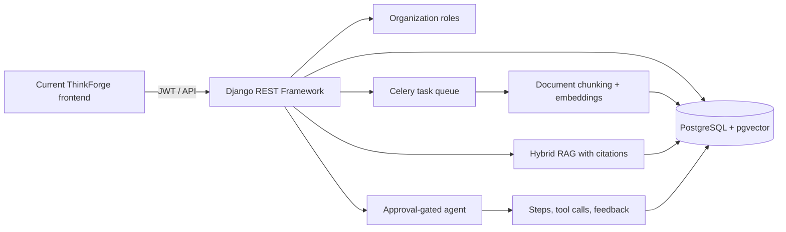

# Django architecture and operating model

## Trust boundaries

- The browser sends a JWT; Django derives the organization role server-side. An organization ID alone never grants access.
- AI provider keys are environment variables and are never accepted from or exposed to the frontend.
- Embeddings are disabled by default. Enable them only after approving the provider, retention policy, and budget.
- The agent may plan and retrieve evidence but cannot invoke external-write tools. External/paid research requires an explicit approval request and every run reaches human review.
- RAG responses carry document/chunk citations. A retrieved excerpt is evidence, not a product decision.

## Retrieval behavior

1. Celery normalizes and chunks an uploaded document.
2. When `AI_EMBEDDING_ENABLED=true`, the server requests embeddings from the configured OpenAI-compatible provider and stores them in pgvector.
3. A query combines lexical candidates and cosine-distance vector candidates using reciprocal-rank fusion.
4. If embeddings are disabled, unavailable, or the database is not PostgreSQL, retrieval intentionally falls back to lexical search and returns that mode in the API response.

## Observability to capture after staging exists

Every response has an `X-Request-ID` and the API logs route, response status, and latency without logging request bodies. DRF applies baseline anonymous/user throttles. Once staging exists, record organization ID hash, queue latency, embedding/provider cost, tool call count, approval decision, and reviewer feedback. Do not invent an SLO or a success rate before real staging traffic is available.
